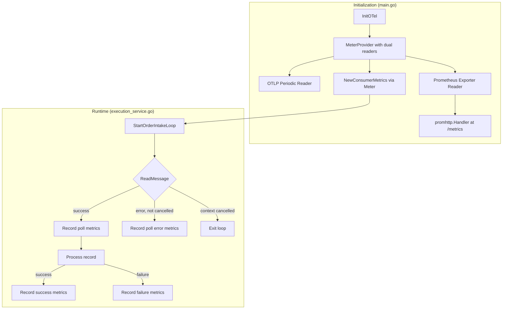

# Design Document: Kafka Consumer Metrics

## Overview

This design adds standardized Kafka consumer metrics instrumentation to the GlobeCo FIX Engine's `StartOrderIntakeLoop`. The implementation uses the OpenTelemetry Go SDK to create metric instruments (counters and histograms) and bridges them to the existing Prometheus `/metrics` endpoint via the `go.opentelemetry.io/otel/exporters/prometheus` package.

The core idea is a thin `ConsumerMetrics` struct that encapsulates all eight OTel instruments and exposes recording methods. The `StartOrderIntakeLoop` is instrumented with timing calls around `ReadMessage` and the processing stages. No business logic changes are required — the metrics layer is purely observational.

**Key design decisions:**
1. **OTel Prometheus exporter as MeterProvider reader** — replaces the current OTLP-only metric reader with a dual-reader setup (OTLP + Prometheus exporter) so instruments are visible at both the OTLP collector and the `/metrics` endpoint.
2. **Single struct, initialize-once pattern** — all instruments are created at startup and stored in a struct passed to `ExecutionService`. No per-message allocations.
3. **Monotonic timing via `time.Now()` / `time.Since()`** — Go's standard library guarantees monotonic clock usage in duration calculations.
4. **Message creation time resolution as a pure function** — extracted into a standalone function for easy property-based testing.

## Architecture



The metrics flow:
1. At startup, `InitOTel` creates a `MeterProvider` with two readers: the existing OTLP periodic reader and a new Prometheus exporter reader.
2. `NewConsumerMetrics` obtains a `Meter` from the provider and creates all 8 instruments.
3. The `ConsumerMetrics` struct is injected into `ExecutionService`.
4. During the consumer loop, timing is captured around `ReadMessage` and the processing stages. Observations are recorded to the appropriate instruments with the required labels.
5. Prometheus scrapes `/metrics` and sees all OTel-registered instruments alongside any existing direct-registered Prometheus metrics.

## Components and Interfaces

### 1. `internal/metrics/consumer_metrics.go` — ConsumerMetrics struct

```go
package metrics

import (
    "context"
    "go.opentelemetry.io/otel/attribute"
    "go.opentelemetry.io/otel/metric"
)

// ConsumerMetrics holds all Kafka consumer metric instruments.
type ConsumerMetrics struct {
    messagesProcessed  metric.Float64Counter
    messagesFailed     metric.Float64Counter
    processingSeconds  metric.Float64Counter
    idleSeconds        metric.Float64Counter
    recordsPolled      metric.Float64Counter
    pollSeconds        metric.Float64Counter
    processingDuration metric.Float64Histogram
    messageLatency     metric.Float64Histogram

    // Pre-computed common attributes (service + consumer_group).
    // Topic and partition are added per-observation.
    commonAttrs []attribute.KeyValue
}

// NewConsumerMetrics creates and registers all metric instruments.
// Returns an error if any instrument cannot be created.
func NewConsumerMetrics(meter metric.Meter, consumerGroup string) (*ConsumerMetrics, error)

// RecordPollSuccess records metrics after a successful ReadMessage.
func (m *ConsumerMetrics) RecordPollSuccess(ctx context.Context, pollDuration float64, topic string, partition int)

// RecordPollError records metrics after a failed ReadMessage (non-cancellation).
func (m *ConsumerMetrics) RecordPollError(ctx context.Context, pollDuration float64)

// RecordProcessingSuccess records metrics after successful message processing.
func (m *ConsumerMetrics) RecordProcessingSuccess(ctx context.Context, processingDuration float64, latency *float64, topic string, partition int)

// RecordProcessingFailure records metrics after failed message processing.
func (m *ConsumerMetrics) RecordProcessingFailure(ctx context.Context, processingDuration float64, latency *float64, topic string, partition int)
```

### 2. `internal/metrics/creation_time.go` — Message creation time resolution

```go
package metrics

import (
    "time"
    "github.com/segmentio/kafka-go"
)

// ResolveMessageCreationTime extracts the message creation timestamp using
// priority: (a) created_at header, (b) createdAt/created_at payload field, (c) Kafka record timestamp.
// Returns the resolved time and whether a valid time was found.
func ResolveMessageCreationTime(msg kafka.Message, payloadJSON []byte) (time.Time, bool)

// CalculateLatency computes end-to-end latency and applies clamping rules.
// Returns the latency in seconds and whether it should be recorded.
func CalculateLatency(creationTime time.Time, completionTime time.Time) (float64, bool)
```

### 3. `internal/config/otel.go` — Modified InitOTel

The existing `InitOTel` function is extended to:
- Add the Prometheus exporter as an additional reader on the `MeterProvider`.
- Return the `MeterProvider` (or make it accessible) so `NewConsumerMetrics` can obtain a `Meter`.

```go
// InitOTel now creates dual readers: OTLP periodic + Prometheus exporter.
// The Prometheus exporter registers with prometheus.DefaultRegisterer,
// making instruments visible via promhttp.Handler() on /metrics.
func InitOTel(ctx context.Context, cfg *Config) (func(context.Context) error, error)
```

### 4. `internal/service/execution_service.go` — Instrumented loop

The `ExecutionService` struct gains a `Metrics *metrics.ConsumerMetrics` field. The `StartOrderIntakeLoop` method is modified to:
1. Capture `time.Now()` before `ReadMessage`.
2. On successful read: record poll duration, start processing timer.
3. On processing success: record processing duration, compute latency, record success metrics.
4. On processing failure: record processing duration, compute latency, record failure metrics.
5. On read error (non-cancellation): record poll error duration.

No changes to business logic, error handling paths, or commit behavior.

## Data Models

### Metric Instruments

| Metric Name | Type | Unit | Bucket Boundaries |
|---|---|---|---|
| `kafka_consumer_messages_processed_total` | Float64Counter | `{message}` | — |
| `kafka_consumer_messages_failed_total` | Float64Counter | `{message}` | — |
| `kafka_consumer_processing_seconds_total` | Float64Counter | `s` | — |
| `kafka_consumer_idle_seconds_total` | Float64Counter | `s` | — |
| `kafka_consumer_records_polled_total` | Float64Counter | `{record}` | — |
| `kafka_consumer_poll_seconds_total` | Float64Counter | `s` | — |
| `kafka_consumer_processing_duration_seconds` | Float64Histogram | `s` | 0.005, 0.010, 0.025, 0.050, 0.100, 0.250, 0.500, 1, 2.5, 5, 10, 30, 60 |
| `kafka_consumer_message_latency_seconds` | Float64Histogram | `s` | 0.010, 0.025, 0.050, 0.100, 0.250, 0.500, 1, 2.5, 5, 10, 30, 60, 120, 300, 600 |

### Label Schema

| Label | Source | Applied To |
|---|---|---|
| `service` | Literal `"globeco-fix-engine"` | All instruments |
| `consumer_group` | Config `Kafka.ConsumerGroup` (default `"fix_engine"`, fallback `"unknown"`) | All instruments |
| `topic` | `kafka.Message.Topic` | All instruments |
| `partition` | `strconv.Itoa(msg.Partition)` or `"unknown"` | All instruments |
| `result` | `"success"` or `"failure"` | Histograms only |

### Message Creation Time Resolution

```
Priority 1: Kafka header "created_at"
  → Parse as: Unix epoch millis (int string), Unix epoch seconds (decimal), or RFC 3339
Priority 2: Payload field "createdAt" or "created_at"
  → Parse as: Unix epoch millis (numeric JSON), or RFC 3339 string
Priority 3: kafka.Message.Time (kafka record timestamp)
  → Use directly if non-zero
Fallback: No valid time → skip latency observation, log warning
```

### Latency Clamping Rules

| Condition | Action |
|---|---|
| latency >= 0 | Record as-is |
| -1s < latency < 0 | Clamp to 0, record |
| latency <= -1s | Skip observation, log warning |

## Correctness Properties

*A property is a characteristic or behavior that should hold true across all valid executions of a system — essentially, a formal statement about what the system should do. Properties serve as the bridge between human-readable specifications and machine-verifiable correctness guarantees.*

### Property 1: Common labels always present and correct

*For any* Kafka record processed by the consumer loop (regardless of outcome), every metric observation produced SHALL contain exactly the four common labels (`service`, `consumer_group`, `topic`, `partition`) with correct values derived from the literal service name, configured consumer group, and the record's metadata.

**Validates: Requirements 2.1, 2.2, 2.3, 2.4, 2.6, 2.8**

### Property 2: Success and failure counters are mutually exclusive and exhaustive

*For any* Kafka record that reaches a terminal outcome, the system SHALL increment exactly one of `kafka_consumer_messages_processed_total` (on success) or `kafka_consumer_messages_failed_total` (on failure) by 1, and SHALL NOT increment the other. For any `ReadMessage` error (excluding context cancellation), neither counter SHALL be incremented.

**Validates: Requirements 3.1, 3.2, 4.1, 4.3, 4.4, 4.5, 4.6**

### Property 3: Time accounting conservation

*For any* complete loop iteration (one `ReadMessage` call plus subsequent processing), the elapsed wall-clock time SHALL be partitioned into exactly two non-overlapping buckets: `kafka_consumer_idle_seconds_total` receives the `ReadMessage` duration, and `kafka_consumer_processing_seconds_total` receives the processing duration. No time is double-counted or lost.

**Validates: Requirements 5.1, 5.2, 5.4, 6.1, 6.2, 6.3, 14.3**

### Property 4: Poll counter increments iff ReadMessage succeeds

*For any* invocation of `ReadMessage`, `kafka_consumer_records_polled_total` SHALL increment by exactly 1 if and only if the call returns without error. On error (whether non-cancellation or cancellation), the counter SHALL NOT increment.

**Validates: Requirements 9.1, 9.2, 14.1, 14.2**

### Property 5: Poll seconds accumulates for all non-cancelled ReadMessage calls

*For any* `ReadMessage` call that completes (success or non-cancellation error), `kafka_consumer_poll_seconds_total` SHALL increase by the monotonic elapsed duration of that call. For context-cancelled calls, no poll time SHALL be recorded.

**Validates: Requirements 10.1, 10.2, 10.3, 10.4, 14.4**

### Property 6: Processing duration histogram records exactly one observation per terminal outcome

*For any* Kafka record reaching a terminal outcome, the system SHALL record exactly one observation to `kafka_consumer_processing_duration_seconds` with the correct `result` label (`"success"` or `"failure"`) and Common_Labels. The recorded value SHALL equal the monotonic elapsed time from processing start to terminal outcome.

**Validates: Requirements 7.1, 7.2, 7.5**

### Property 7: Message creation time priority resolution

*For any* Kafka message, `ResolveMessageCreationTime` SHALL return the value from the highest-priority valid source: (a) `created_at` header > (b) `createdAt`/`created_at` payload field > (c) Kafka record timestamp. If a higher-priority source provides a valid parseable time, lower-priority sources SHALL be ignored regardless of their content.

**Validates: Requirements 8.3**

### Property 8: Latency observation recorded iff valid creation time and non-negative (or clampable) result

*For any* Kafka record reaching a terminal outcome: if a valid `Message_Creation_Time` exists and the computed latency is >= -1s, the system SHALL record exactly one latency observation (clamped to 0 if negative). If no valid creation time exists or latency < -1s, no observation SHALL be recorded.

**Validates: Requirements 8.1, 8.2, 8.4, 8.5, 8.6**

### Property 9: Context cancellation produces zero metric observations

*For any* `ReadMessage` call interrupted by context cancellation (i.e., `ctx.Err() != nil` after the call), the system SHALL record zero metric observations of any kind for that call.

**Validates: Requirements 9.3, 10.4, 14.5**

### Property 10: Metric recording errors do not propagate to consumer loop

*For any* internal error during a metric recording operation (nil instrument, attribute error, SDK panic), the error SHALL be suppressed and the consumer loop SHALL continue processing subsequent records without interruption.

**Validates: Requirements 12.6**

### Property 11: Concurrency safety

*For any* set of concurrent goroutines accessing the `ConsumerMetrics` struct simultaneously, the Go race detector SHALL report zero data races.

**Validates: Requirements 1.6, 12.4**

## Error Handling

| Error Scenario | Behavior |
|---|---|
| Instrument creation fails at startup | `NewConsumerMetrics` returns error → service does not start consumer loop |
| `ReadMessage` returns context cancellation | Exit loop, no metrics recorded for that call |
| `ReadMessage` returns other error | Record poll duration to `poll_seconds_total` and `idle_seconds_total`, log error, continue loop |
| JSON deserialization fails | Record processing failure metrics, log error, continue loop |
| Security service lookup fails | Record processing failure metrics, log error, continue loop |
| Database persistence fails | Record processing failure metrics, log error, continue loop |
| Metric recording panics/errors | Suppress (recover if panic), log at debug level, continue processing |
| No valid Message_Creation_Time | Skip latency observation, log structured warning with record offset |
| Negative latency >= 1s | Skip latency observation, log structured warning |
| Negative latency < 1s | Clamp to 0, record observation normally |
| Non-positive monotonic duration | Clamp to 0, record normally |

## Testing Strategy

### Property-Based Tests (using `github.com/leanovate/gopter`)

Each correctness property is implemented as a property-based test with minimum 100 iterations. The property-based testing library `gopter` (Go Property Testing) is used for generator-based test input.

**Configuration:**
- Minimum 100 iterations per property test
- Each test tagged with: `Feature: kafka-consumer-metrics, Property {N}: {title}`
- Tests exercise the pure logic layer (creation time resolution, label computation, latency calculation) with generated inputs
- Consumer loop integration tests use a mock `metric.Meter` and mock dependencies

**Property test targets:**
- `ResolveMessageCreationTime` — Property 7 (priority resolution)
- `CalculateLatency` — Property 8 (clamping rules)
- Label construction functions — Properties 1, 4
- Counter increment logic — Properties 2, 3, 5, 6
- Error suppression — Property 10
- Concurrency — Property 11

### Unit Tests (example-based)

- Instrument initialization verifies all 8 instruments created with correct names/buckets (Requirements 1.1–1.5)
- Specific failure scenarios: deserialization error, service error, DB error (Requirements 4.3–4.5)
- Empty consumer group falls back to `"unknown"` (Requirement 2.7)
- Invalid partition falls back to `"unknown"` (Requirement 2.5)
- Monotonic clock usage verified by code structure (Requirement 13.1)

### Integration Tests

- `/metrics` endpoint exposes OTel-registered metrics in Prometheus text format (Requirement 11.1–11.6)
- End-to-end: produce message to Kafka → consume → verify metrics scraped from `/metrics`
- Prometheus bridge coexists with any direct-registered Prometheus metrics

### Benchmarks

- `BenchmarkRecordMetrics` verifies < 1ms per recording operation (Requirement 12.2)
- `BenchmarkRecordMetricsAllocs` verifies zero heap allocations per observation (Requirement 12.3)

### Dependencies

- New: `go.opentelemetry.io/otel/exporters/prometheus` — OTel Prometheus bridge exporter
- New: `github.com/leanovate/gopter` — property-based testing (test-only dependency)
- Existing: `go.opentelemetry.io/otel/metric`, `go.opentelemetry.io/otel/sdk/metric`
- Existing: `github.com/prometheus/client_golang/prometheus/promhttp`
